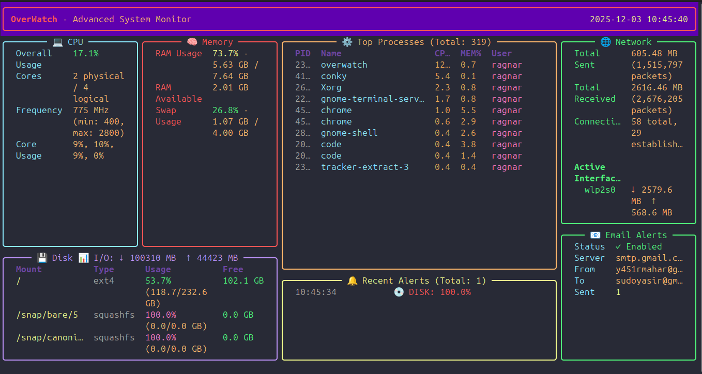

# OverWatch 🔭

**Advanced System Monitoring CLI Tool**

OverWatch is a powerful, terminal-based system monitor built with Python. It provides real-time monitoring of CPU, memory, disk, network, and processes with a beautiful Rich/Textual UI, plugin support, configurable alerts, and a RESTful API.


---

## 🌟 Features

- **📊 Real-time Dashboard**: Beautiful terminal UI powered by Rich
- **🔌 Plugin System**: Extensible architecture for custom monitoring modules
- **🚨 Smart Alerts**: Threshold-based notifications via Email and Telegram
- **🌐 REST API**: FastAPI server with WebSocket support for real-time data
- **🖥️ Cross-Platform**: Works on Linux, macOS, and Windows
- **⚡ Performance Monitoring**:
  - CPU usage (overall & per-core)
  - Memory (RAM & Swap)
  - Disk usage & I/O
  - Network statistics
  - Process details
  - Temperature sensors (when available)

---

## 📦 Installation

### Quick Install with Virtual Environment (Recommended)

```bash
git clone https://github.com/sudoyasir/overwatch.git
cd overwatch
./quick_setup.sh
source venv/bin/activate
```

### Manual Installation

```bash
# Create virtual environment
python3 -m venv venv
source venv/bin/activate

# Install
pip install -e .
```

### Requirements

- Python 3.10 or higher
- pip package manager

### Dependencies

All dependencies are automatically installed:
- `psutil` - System and process utilities
- `rich` - Terminal UI
- `click` - CLI framework
- `fastapi` - API server
- `uvicorn` - ASGI server
- `requests` - HTTP client
- `websockets` - WebSocket support

---

## 🚀 Quick Start

**Note**: Always activate the virtual environment first:
```bash
source venv/bin/activate
```

### Launch Terminal Dashboard

```bash
overwatch start
```

Options:
- `--refresh` or `-r`: Set refresh rate in seconds (default: 1.0)

Example:
```bash
overwatch start --refresh 0.5
```

### Start API Server

```bash
overwatch api
```

Options:
- `--host` or `-h`: Host address (default: 0.0.0.0)
- `--port` or `-p`: Port number (default: 8000)

Example:
```bash
overwatch api --host 127.0.0.1 --port 9000
```

**Understanding the API Host:**
- `0.0.0.0` means the server listens on ALL network interfaces
- Access locally: `http://localhost:8000` or `http://127.0.0.1:8000`
- Access from other devices on your network: `http://YOUR_SERVER_IP:8000`
- Find your server IP: `hostname -I` (Linux) or `ipconfig` (Windows)

**Interactive API Documentation:**
- Swagger UI: `http://localhost:8000/docs`
- ReDoc: `http://localhost:8000/redoc`

### Other Commands

```bash
# Show version information
overwatch version

# Display system information
overwatch info

# List available plugins
overwatch plugins

# Show current metrics
overwatch metrics --format json
```

---

## 📡 API Usage Guide

### Starting the API Server

The API server runs on `0.0.0.0:8000` by default, which means:
- **Local access**: `http://localhost:8000` or `http://127.0.0.1:8000`
- **Network access**: `http://YOUR_SERVER_IP:8000` (from other devices on your network)
- **Production**: Use a reverse proxy like Nginx or deploy behind a load balancer

### REST API Endpoints

| Endpoint | Method | Description | Example |
|----------|--------|-------------|---------|
| `/` | GET | API root info | `curl http://localhost:8000/` |
| `/health` | GET | Health check | `curl http://localhost:8000/health` |
| `/metrics` | GET | All system metrics | `curl http://localhost:8000/metrics` |
| `/metrics/cpu` | GET | CPU usage & stats | `curl http://localhost:8000/metrics/cpu` |
| `/metrics/memory` | GET | RAM & swap usage | `curl http://localhost:8000/metrics/memory` |
| `/metrics/disk` | GET | Disk usage & I/O | `curl http://localhost:8000/metrics/disk` |
| `/metrics/network` | GET | Network stats | `curl http://localhost:8000/metrics/network` |
| `/metrics/processes` | GET | Running processes | `curl http://localhost:8000/metrics/processes?limit=10` |
| `/metrics/sensors` | GET | Temperature sensors | `curl http://localhost:8000/metrics/sensors` |
| `/process/{pid}` | GET | Process details | `curl http://localhost:8000/process/1234` |

### Practical Examples

#### 1. Get CPU Usage (Shell/Bash)
```bash
# Simple request
curl http://localhost:8000/metrics/cpu

# Pretty print JSON
curl -s http://localhost:8000/metrics/cpu | jq '.'

# Get only CPU percentage
curl -s http://localhost:8000/metrics/cpu | jq '.percent'
```

#### 2. Monitor Memory (Python)
```python
import requests

response = requests.get('http://localhost:8000/metrics/memory')
data = response.json()

print(f"RAM Usage: {data['virtual']['percent']}%")
print(f"Available: {data['virtual']['available_gb']:.2f} GB")
```

#### 3. Watch Disk Space (Node.js)
```javascript
const axios = require('axios');

async function checkDisk() {
    const response = await axios.get('http://localhost:8000/metrics/disk');
    response.data.partitions.forEach(partition => {
        console.log(`${partition.device}: ${partition.percent}% used`);
    });
}

checkDisk();
```

#### 4. Real-Time Monitoring Dashboard (HTML/JavaScript)
```html
<!DOCTYPE html>
<html>
<head>
    <title>OverWatch Monitor</title>
</head>
<body>
    <h1>System Monitor</h1>
    <div id="metrics"></div>
    
    <script>
        async function updateMetrics() {
            const response = await fetch('http://localhost:8000/metrics');
            const data = await response.json();
            
            document.getElementById('metrics').innerHTML = `
                <p>CPU: ${data.cpu.percent}%</p>
                <p>Memory: ${data.memory.virtual.percent}%</p>
                <p>Disk: ${data.disk.partitions[0].percent}%</p>
            `;
        }
        
        // Update every 2 seconds
        setInterval(updateMetrics, 2000);
        updateMetrics();
    </script>
</body>
</html>
```

#### 5. Alert System (Python)
```python
import requests
import time

THRESHOLDS = {
    'cpu': 90,
    'memory': 85,
    'disk': 90
}

def check_alerts():
    response = requests.get('http://localhost:8000/metrics')
    data = response.json()
    
    if data['cpu']['percent'] > THRESHOLDS['cpu']:
        print(f"⚠️  HIGH CPU: {data['cpu']['percent']}%")
    
    if data['memory']['virtual']['percent'] > THRESHOLDS['memory']:
        print(f"⚠️  HIGH MEMORY: {data['memory']['virtual']['percent']}%")
    
    for partition in data['disk']['partitions']:
        if partition['percent'] > THRESHOLDS['disk']:
            print(f"⚠️  HIGH DISK ({partition['mountpoint']}): {partition['percent']}%")

while True:
    check_alerts()
    time.sleep(60)  # Check every minute
```

#### 6. Export to CSV (Python)
```python
import requests
import csv
from datetime import datetime

def log_metrics_to_csv():
    response = requests.get('http://localhost:8000/metrics')
    data = response.json()
    
    with open('metrics_log.csv', 'a', newline='') as f:
        writer = csv.writer(f)
        writer.writerow([
            datetime.now().isoformat(),
            data['cpu']['percent'],
            data['memory']['virtual']['percent'],
            data['disk']['partitions'][0]['percent']
        ])

log_metrics_to_csv()
```

### WebSocket Real-Time Streaming

Connect to `/ws` for live metrics updates (1 second interval).

**Python Example:**
```python
import asyncio
import websockets
import json

async def monitor():
    uri = "ws://localhost:8000/ws"
    async with websockets.connect(uri) as websocket:
        while True:
            message = await websocket.recv()
            data = json.loads(message)
            print(f"CPU: {data['cpu']['percent']}% | Memory: {data['memory']['virtual']['percent']}%")

asyncio.run(monitor())
```

**JavaScript Example:**
```javascript
const ws = new WebSocket('ws://localhost:8000/ws');

ws.onopen = () => {
    console.log('Connected to OverWatch');
};

ws.onmessage = (event) => {
    const metrics = JSON.parse(event.data);
    console.log('CPU:', metrics.cpu.percent + '%');
    console.log('Memory:', metrics.memory.virtual.percent + '%');
};

ws.onerror = (error) => {
    console.error('WebSocket error:', error);
};
```

### Use Cases

1. **DevOps Monitoring**: Integrate with Grafana, Prometheus, or custom dashboards
2. **CI/CD Pipelines**: Monitor build server resources during deployments
3. **Load Testing**: Track system performance during stress tests
4. **Mobile Apps**: Build iOS/Android apps that monitor your servers
5. **Slack/Discord Bots**: Send alerts to team channels when thresholds are exceeded
6. **Data Analysis**: Collect historical data for capacity planning
7. **Home Automation**: Trigger actions based on system metrics

---

## 🔌 Plugin Development

Create custom plugins to extend OverWatch functionality.

### Plugin Structure

1. Create a new Python file in `overwatch/plugins/`
2. Implement a `run()` function that returns a dict

### Example Plugin

```python
# overwatch/plugins/my_plugin.py

from typing import Dict, Any

def run() -> Dict[str, Any]:
    """
    Your plugin logic here.
    
    Returns:
        Dict with plugin name and data
    """
    return {
        "name": "My Custom Plugin",
        "data": {
            "status": "active",
            "value": 42
        },
        "status": "success",
    }

# Optional: Plugin metadata
PLUGIN_INFO = {
    "name": "My Plugin",
    "version": "1.0.0",
    "description": "Does something awesome",
    "author": "Your Name",
}
```

### Loading Plugins

Plugins are automatically discovered and loaded from the `overwatch/plugins/` directory. Use `overwatch plugins` to list all available plugins.

---

## 🚨 Alert Configuration

### Configure Thresholds

Edit `overwatch/alerts/thresholds.json`:

```json
{
  "cpu": {
    "threshold": 90,
    "enabled": true
  },
  "memory": {
    "threshold": 80,
    "enabled": true
  },
  "disk": {
    "threshold": 85,
    "enabled": true
  },
  "temperature": {
    "threshold": 80,
    "enabled": false
  }
}
```

### Email Notifications

Set environment variables:

```bash
export EMAIL_SMTP_SERVER="smtp.gmail.com"
export EMAIL_SMTP_PORT="587"
export EMAIL_SMTP_USERNAME="your-email@gmail.com"
export EMAIL_SMTP_PASSWORD="your-app-password"
export EMAIL_FROM="your-email@gmail.com"
export EMAIL_TO="recipient@example.com"
```

### Telegram Notifications

Set environment variables:

```bash
export TELEGRAM_BOT_TOKEN="your-bot-token"
export TELEGRAM_CHAT_ID="your-chat-id"
```

To create a Telegram bot:
1. Message [@BotFather](https://t.me/botfather)
2. Create a new bot with `/newbot`
3. Get your chat ID from [@userinfobot](https://t.me/userinfobot)

---

## 🏗️ Project Structure

```
overwatch/
├── core/                  # Monitoring modules
│   ├── cpu.py
│   ├── memory.py
│   ├── disk.py
│   ├── network.py
│   ├── processes.py
│   └── sensors.py
├── ui/                    # Dashboard UI
│   ├── dashboard.py
│   └── components/
│       ├── cpu_panel.py
│       ├── memory_panel.py
│       ├── disk_panel.py
│       ├── network_panel.py
│       └── process_panel.py
├── plugins/               # Plugin system
│   ├── __init__.py
│   └── example_plugin.py
├── alerts/                # Alert system
│   ├── manager.py
│   ├── telegram.py
│   ├── email.py
│   └── thresholds.json
├── api/                   # REST API
│   ├── server.py
│   └── websocket.py
├── cli/                   # CLI interface
│   ├── main.py
│   └── commands.py
├── utils/                 # Utilities
│   ├── loader.py
│   └── system_info.py
└── overwatch.py          # Main entry point
```

---

## 🖼️ Screenshots



---

## 🧪 Development

### Setup Development Environment

```bash
# Clone the repository
git clone https://github.com/sudoyasir/overwatch.git
cd overwatch

# Install in development mode
pip install -e .

# Run tests (if available)
pytest
```

### Run from Source

```bash
python -m overwatch.cli.main start
```

---

## 🤝 Contributing

Contributions are welcome! Please feel free to submit a Pull Request.

1. Fork the repository
2. Create your feature branch (`git checkout -b feature/AmazingFeature`)
3. Commit your changes (`git commit -m 'Add some AmazingFeature'`)
4. Push to the branch (`git push origin feature/AmazingFeature`)
5. Open a Pull Request

---

## 📝 License

This project is licensed under the MIT License - see the LICENSE file for details.

---

## 🙏 Acknowledgments

- Built with [psutil](https://github.com/giampaolo/psutil) for system monitoring
- UI powered by [Rich](https://github.com/Textualize/rich)
- API built with [FastAPI](https://fastapi.tiangolo.com/)

---

## 📧 Contact

For questions, issues, or suggestions:
- GitHub Issues: https://github.com/sudoyasir/overwatch/issues
- Email: info@overwatch.dev

---

**Made with ❤️ by the OverWatch Team**
